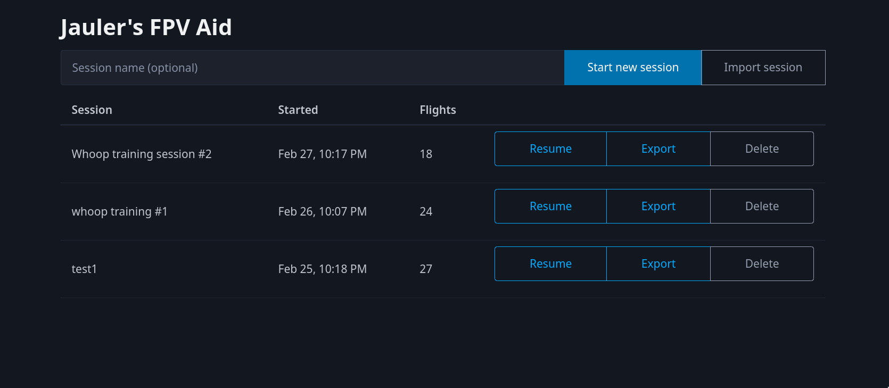
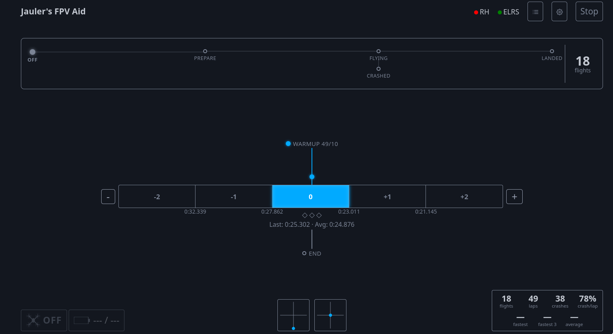
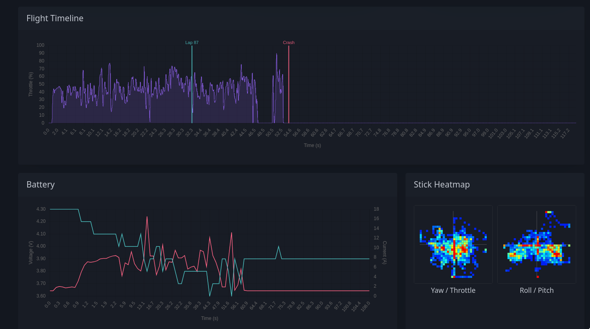
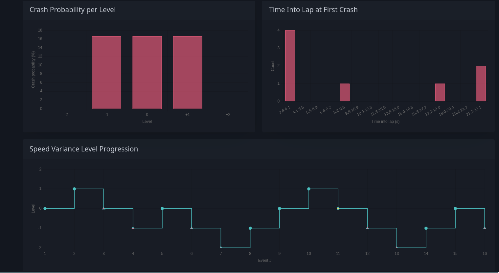

# Jauler's FPV Aid

A real-time FPV drone racing training aid. Connects to your drone's ELRS receiver and a RotorHazard timing system to provide live telemetry, lap timing, crash detection, and structured speed variance training — all from your browser.

**[Try it live](https://aid.jauler.eu)** — import [example session data](contrib/fpv-aid-whoop-training-%231.json) to explore the review screens without hardware

<p align="center">
  
  
  <br />
  
  
</p>

## Requirements

- A browser with [Web Serial API](https://caniuse.com/web-serial) support (Chrome, Edge, Opera)
- An ExpressLRS receiver flashed with [ExpressLRS-sniffer](https://github.com/Jauler/ExpressLRS-sniffer) firmware, connected via USB/serial
- A [RotorHazard](https://github.com/RotorHazard/RotorHazard) timing system (optional, for lap timing)

## Features

- **ELRS telemetry via Web Serial** — connect directly to an ExpressLRS receiver at 420k baud for real-time CRSF data (battery, attitude, GPS, link stats, stick inputs, flight mode, and more)
- **RotorHazard integration** — receives lap crossing events over WebSocket for automated lap timing
- **Flight state detection** — automatic armed/disarmed/flying/landed/crashed state machine with configurable arm and turtle mode channels
- **Speed variance training** — structured drill with 5 speed levels around a baseline lap time, audio-guided level progression, and configurable band percentages
- **Live overlays** — animated drone icon, battery gauge, stick position indicators, real-time stats, and speed variance gauge
- **Session recording** — all flights, laps, crashes, battery samples, and stick inputs are stored locally in IndexedDB
- **Session review** — post-session charts including lap time trends, lap time distribution, crash timing, speed level progression, and per-flight battery/stick detail
- **Export/import** — full session data as JSON for backup or sharing
- **Audio feedback** — TTS announcements for flight state changes and level targets, audio cues for on-target laps
- **PWA** — installable, works offline after first load

## Speed Variance Training

Speed variance training builds throttle control by asking you to fly laps not just fast, but at **specific target speeds** — both faster and slower than your natural pace. A pilot who can hit a precise lap time on demand, whether above or below their comfort zone, has far better racecraft than one who only knows full send.

### How it works

1. **Warmup** — Fly 10 laps (configurable) at your natural pace. The system watches your times and computes a baseline from the average of your fastest 30%.

2. **Speed levels** — Once warmup is complete, the system assigns you a target level. There are 5 levels defined as percentage bands around your baseline:

   | Level | Target |
   |-------|--------|
   | **+2** | Faster than 15% below baseline |
   | **+1** | Between 7.5% and 15% below baseline |
   | **0** | Your baseline band (7.5% fast to 12% slow) |
   | **-1** | Between 12% and 30% above baseline |
   | **-2** | Slower than 30% above baseline |

   All band percentages are configurable in settings. You start at level 0.

3. **Progression** — Land 3 consecutive laps within your target range to advance one level. Crashing drops you one level. Audio cues tell you if each lap was on target, too fast, or too slow, and announce the new target range on every level change.

4. **Live gauge** — A 5-segment bar shows your current level, the target lap time range, and your streak progress toward the next level.

The drill is intentionally asymmetric — the slow bands are wider than the fast ones, because flying *precisely slow* is a different skill than flying fast. Mastering both directions is the point.

## Connecting to RotorHazard

If your RotorHazard server runs on plain HTTP (no TLS), the browser will block the connection because the app is served over HTTPS. To allow it:

1. Click the lock/tune icon in the address bar
2. Go to **Site settings**
3. Find **Insecure content** and set it to **Allow**
4. Reload the page

This lets the app make non-encrypted connections to your local RotorHazard server.

## Tech Stack

[Vite](https://vite.dev/) + [Preact](https://preactjs.com/) + TypeScript, styled with [Pico CSS](https://picocss.com/). Data stored client-side via [Dexie](https://dexie.org/) (IndexedDB). Charts rendered with [Chart.js](https://www.chartjs.org/).

## Development

```bash
npm install
npm run dev
```

Build for production:

```bash
npm run build
```

Output goes to `dist/`. Deployed automatically to GitHub Pages on push to `main`.

## License

MIT
